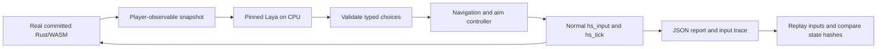

# AI gameplay QA: first milestone

Laya is a test-time autonomous player, never a shipped BLACKSITE dependency.
Stage 1 proves the engine/state/decision/input loop with a small manual CI run.
It does not assert campaign or boss completion, establish weapon balance, or
replace the existing browser and Rust tests.



## Exact runtime

- Model: `convaiinnovations/laya`, subfolder `typed-decisions`.
- Revision: `7b928d828b7b0e022f929d9bd2e44165aa270148`.
- Parameters: 421,293,827; Apache 2.0 model license.
- SDK: Laya 0.4.0, eager PyTorch 2.8.0+cpu, Transformers 4.57.1, Python 3.12.
- Runtime: one persistent Python process with two CPU inference threads; Node 24
  loads the game's WASM using its built-in runtime. No WASM runtime package or
  frontend npm installation is needed by this workflow.
- Protocol: bounded JSONL requests/responses, with initialization and inference
  deadlines. Model logs go to a separate file, not the protocol stream.
- Dependencies are fully pinned in `scripts/ai/requirements.txt`. Checkpoint and
  SDK pins live in `scripts/ai/config.json`; no `latest` weights are downloaded.

The SDK supports CPU eager execution of the encoder and typed decision head;
GGUF is unnecessary for this prototype. Only the selected checkpoint is loaded.
[Upstream model card](https://huggingface.co/convaiinnovations/laya).

## Observation and actions

The harness reuses the HUD layout and enemy decoder from the game. It reads
`hs_hud_ptr`, `hs_prepare_enemies`/`hs_enemy_cues`, and the map/door exports.
Only living enemies with line of sight and an on-screen horizontal position
enter the model observation. Hidden enemy coordinates and exact enemy health
are omitted. The visible hostile count, player health/ammo/ownership, position,
damage direction, reload state, boss HUD and objective coordinates are already
shown in the HUD/minimap. The route controller uses that minimap geometry.

One SDK prediction requests movement and combat choices, plus utility choices
when reload or interaction is applicable. Input state uses rounded numbers and
a 1,024-token context; truncation is treated as an integration failure. Aim and
navigation are deterministic controllers. Scanning applies while stationary so
it cannot oppose navigation steering. Firing requires a visible target, ammo,
no active reload and no indicated self-splash risk. The first scenario retains
the normally equipped pistol; broader weapon selection is deferred.

At most 24 decisions hold keys for 30 fixed 1/60-second ticks each. Mouse deltas
apply once. Significant damage, kills, empty magazines, completed reloads, boss
phase changes and a newly visible enemy interrupt the interval. Wall time spent
in model inference does not advance game time. Normal death ends the run and
is reported as player failure, rather than failing CI.

The harness does not call `hs_qa`, grant weapons, teleport, patch memory, advance
waves, render frames or enable god mode. A separate normal-input preflight checks
movement, turning, ammo consumption, reload transfer and interaction input
acceptance. It does not count those probe actions as AI gameplay. Interaction
acceptance at spawn is not proof of objective completion; an actual nearby
interaction effect and objective/boss progression require later scenarios.

## Reproducibility and failure handling

Each episode begins with a fresh `hs_init`: sector 1, ordinary health, enemies
and pistol. The engine currently seeds that start with `0xC0FFEE`. Model inference
uses seed 1729 and deterministic Torch algorithms. Across different CPU/runtime
versions, predictions may change; the guaranteed replay is the recorded input
trace, not regenerated model decisions.

The harness checks finite HUD/enemy/door values, map bounds, player geometry,
nonnegative ammo/counts and an advancing simulation clock. A fresh WASM instance
replays every recorded input and compares complete decoded state hashes at each
decision boundary. Different ML latency cannot alter this replay.

Malformed typed output produces neutral input and an integration failure report;
it cannot select arbitrary exports or inject bits/mouse values. WASM traps,
invalid state, broken input preflight, protocol/schema errors and replay divergence
fail the workflow. Poor aiming, normal death, no kills, and ineffective movement
are reported separately. Detecting permanent stalls or impossible encounters as
engine regressions needs dedicated reproducible scenarios, not an arbitrary AI
failure to complete the sector.

## Run locally or on GitHub

Use an isolated environment; do not install ML dependencies into the game:

```sh
python3 -m venv .blacksite/laya-venv
.blacksite/laya-venv/bin/pip install --index-url https://download.pytorch.org/whl/cpu torch==2.8.0+cpu
.blacksite/laya-venv/bin/pip install -r scripts/ai/requirements.txt
BLACKSITE_AI_PYTHON="$PWD/.blacksite/laya-venv/bin/python" \
  HF_HOME="$PWD/.blacksite/huggingface" npm run test:ai:smoke
```

Tests of input validation, observations and deterministic replay need no model:

```sh
node --experimental-strip-types --test scripts/ai/simulation.test.mjs
```

Dispatch the **AI gameplay smoke** workflow in GitHub Actions or use
`gh workflow run ai-game-smoke.yml`. It runs on the standard `ubuntu-latest` CPU
runner, checks committed WASM synchronization, installs CPU-only Torch and pinned
packages, caches model files and runs the short smoke test. It has a 15-minute
job timeout, no PR trigger, no long-run tier and no deployment dependency.

The output directory defaults to ignored `.blacksite/ai-smoke/` and contains:

- `report.json`: separate checks, player warnings, categorized failures, model
  revision/device/parameter count, RSS, WASM hash, configuration and metrics.
- `summary.txt`: readable PASS/FAIL and observed gameplay actions.
- `trace.jsonl`: observations, choices, effective inputs, ticks, state hashes and
  inference timings/token usage for each decision.
- `laya.log`: model initialization/inference diagnostics.

The workflow publishes the text as its job summary and retains all four files
as a 14-day artifact. `wallSeconds` measures the harness; total workflow runtime
also includes provisioning, dependency installation and model/cache transfer.

## Measurements and next step

Initial local CPU loading took about 33 seconds including a cold model download
and peaked around 2.8 GiB process RSS. These are local measurements, not promised
runner timings; each report records its own load, inference, memory and wall time.
Hosted measurements are saved in each job summary and `report.json`; total job
runtime is shown in the [CPU smoke runs](https://github.com/Idanbot/wasm-doom/actions/workflows/ai-game-smoke.yml).

The final local 24-decision run passed with 12 shots, two kills, one observed
interaction effect and exact deterministic replay. It simulated 9.77 seconds;
its harness wall time was 305 seconds while other local checks were running.
The agent did not reload its empty pistol despite reserve ammo; the independent
reload contract passed, so this is a player warning, not an engine failure.

The checkpoint emits a warning about an out-of-range calibration temperature
for choices with eleven or more options. Our schemas have at most six choices;
the harness nevertheless does not use model confidence as a correctness oracle.
The model is trained on business decision workflows, so its gameplay skill needs
independent evaluation.

Next: a few short, hand-authored **normal gameplay** scenarios for door/terminal
interaction, visible-target damage, reload interruption and first-boss progression.
Measure a scripted policy against Laya with identical starts and input budgets.
Only after that comparison should we add game-specific fine-tuning, multiple
sectors, balance comparisons or required PR execution.
