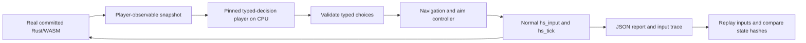

# AI gameplay QA

The hosted workflow now uses only Decider; local Laya support and earlier
comparisons below are retained as historical/reference tooling. Neither is a
shipped BLACKSITE dependency.
Stage 1 proves the engine/state/decision/input loop with a small manual CI run.
It does not assert campaign or boss completion, establish weapon balance, or
replace the existing browser and Rust tests.



## Original Laya runtime (local/historical)

- Model: `convaiinnovations/laya`, subfolder `typed-decisions`.
- Revision: `7b928d828b7b0e022f929d9bd2e44165aa270148`.
- Parameters: 421,293,827; Apache 2.0 model license.
- SDK: Laya 0.4.0, eager PyTorch 2.8.0+cpu, Transformers 4.57.1, Python 3.12.
- Runtime: one persistent Python process with two CPU inference threads; Node 24
  loads the game's WASM using its built-in runtime. No WASM runtime package or
  frontend npm installation is needed by this workflow.
- Protocol: bounded JSONL requests/responses, with initialization and inference
  deadlines. Model logs go to a separate file, not the protocol stream.
- Dependencies are fully pinned in `scripts/ai/requirements.txt`. Checkpoint and
  SDK pins live in `scripts/ai/config.json`; no `latest` weights are downloaded.

The SDK supports CPU eager execution of the encoder and typed decision head;
GGUF is unnecessary for this prototype. Only the selected checkpoint is loaded.
[Upstream model card](https://huggingface.co/convaiinnovations/laya).

## Observation and actions

The harness reuses the HUD layout and enemy decoder from the game. It reads
`hs_hud_ptr`, `hs_prepare_enemies`/`hs_enemy_cues`, and the map/door exports.
Only living enemies with line of sight and an on-screen horizontal position
enter the model observation. Hidden enemy coordinates and exact enemy health
are omitted. The visible hostile count, player health/ammo/ownership, position,
damage direction, reload state, boss HUD and objective coordinates are already
shown in the HUD/minimap. The route controller uses that minimap geometry.

One SDK prediction requests movement and combat choices, plus utility choices
when reload or interaction is applicable. Input state uses rounded numbers and
a 1,024-token context; truncation is treated as an integration failure. Aim and
navigation are deterministic controllers. Scanning applies while stationary so
it cannot oppose navigation steering. Firing requires a visible target, ammo,
no active reload and no indicated self-splash risk. The first scenario retains
the normally equipped pistol; broader weapon selection is deferred.

At most 24 decisions hold keys for 30 fixed 1/60-second ticks each. Mouse deltas
apply once. Significant damage, kills, empty magazines, completed reloads, boss
phase changes and a newly visible enemy interrupt the interval. Wall time spent
in model inference does not advance game time. Normal death ends the run and
is reported as player failure, rather than failing CI.

During play the harness does not call `hs_qa`, grant weapons, teleport, patch
memory, skip waves, render frames or enable god mode. Short-tier setup uses the
normal checkpoint loader to start isolated stock sectors 2 and 3; only the saved
sector number changes. The agent cannot call that loader. A separate normal-input preflight checks
movement, turning, ammo consumption, reload transfer and interaction input
acceptance. It does not count those probe actions as AI gameplay. Interaction
acceptance at spawn is not proof of objective completion; an actual nearby
interaction effect and objective/boss progression require later scenarios.

## Reproducibility and failure handling

Each episode begins with a fresh `hs_init`: sector 1, ordinary health, enemies
and pistol. The engine currently seeds that start with `0xC0FFEE`. Model inference
uses seed 1729 and deterministic Torch algorithms. Across different CPU/runtime
versions, predictions may change; the guaranteed replay is the recorded input
trace, not regenerated model decisions.

The harness checks finite HUD/enemy/door values, map bounds, player geometry,
nonnegative ammo/counts and an advancing simulation clock. A fresh WASM instance
replays every recorded input and compares complete decoded state hashes at each
decision boundary. Different ML latency cannot alter this replay.

Malformed typed output produces neutral input and an integration failure report;
it cannot select arbitrary exports or inject bits/mouse values. WASM traps,
invalid state, broken input preflight, protocol/schema errors and replay divergence
fail the workflow. Poor aiming, normal death, no kills, and ineffective movement
are reported separately. Detecting permanent stalls or impossible encounters as
engine regressions needs dedicated reproducible scenarios, not an arbitrary AI
failure to complete the sector.

## Run locally or on GitHub

Use an isolated environment; do not install ML dependencies into the game:

```sh
python3 -m venv .blacksite/laya-venv
.blacksite/laya-venv/bin/pip install --index-url https://download.pytorch.org/whl/cpu torch==2.8.0+cpu
.blacksite/laya-venv/bin/pip install -r scripts/ai/requirements.txt
BLACKSITE_AI_PYTHON="$PWD/.blacksite/laya-venv/bin/python" \
  HF_HOME="$PWD/.blacksite/huggingface" npm run test:ai:smoke
```

Tests of input validation, observations and deterministic replay need no model:

```sh
node --experimental-strip-types --test scripts/ai/simulation.test.mjs
```

Dispatch with `gh workflow run ai-game-smoke.yml -f tier=extended`.
Hosted runs use only pinned Decider v2.1 Q4_K_M. The extended tier has a shared
**30-minute wall-clock budget and 512-decision cap for the whole harness**,
including model startup and replay, rather than granting each sector 30 minutes.
It tests sectors 1, 2, 3, 5, 10, 15, 20, 25 and three boss encounters sampled
without replacement from levels 1–25. Seed 1729 selects bosses 24, 12 and 20;
`BLACKSITE_AI_SCENARIO_SEED` changes the reproducible local selection.

Boss setup uses existing QA fixture exports to enter the arena, remove ordinary
hostiles and spawn the real full-health boss with its support enemies, then
turns QA **off** before gameplay. Health, armor and pistol inventory remain stock.
The model cannot invoke these exports. These isolated fixtures test actual boss
combat, not successful navigation or normal boss activation. Fixture identity
is recorded and used for deterministic input replay.

Each remaining scenario receives a fair share of remaining time and decisions;
unused budget after death or victory rolls forward. Inference reserves its
60-second response deadline before starting another request. Missing scenario
reports fail collection. The 40-minute job safety timeout allows setup and
artifact upload outside the harness budget. Only one workflow executes across
branches, with later dispatches queued. `smoke` and `short` remain small.
The extended artifact contains the combined report, `budget.json`, and per-case
reports, traces and diagnostics under `episodes/`. No PR or deployment dependency.

The output directory defaults to ignored `.blacksite/ai-smoke/` and contains:

- `report.json`: separate checks, player warnings, categorized failures, model
  revision/device/parameter count, RSS, WASM hash, configuration and metrics.
- `summary.txt`: readable PASS/FAIL and observed gameplay actions.
- `trace.jsonl`: observations, choices, effective inputs, ticks, state hashes and
  inference timings/token usage for each decision.
- `laya.log` or `decider.log`: model initialization/inference diagnostics.

The workflow publishes the text as its job summary and retains all four files
as a 14-day artifact per model. `wallSeconds` measures the harness; total workflow runtime
also includes provisioning, dependency installation and model/cache transfer.

## Measurements and next step

Initial local CPU loading took about 33 seconds including a cold model download
and peaked around 2.8 GiB process RSS. These are local measurements, not promised
runner timings; each report records its own load, inference, memory and wall time.
Hosted measurements are saved in each job summary and `report.json`; total job
runtime is shown in the [CPU smoke runs](https://github.com/Idanbot/wasm-doom/actions/workflows/ai-game-smoke.yml).

The final local 24-decision run passed with 12 shots, two kills, one observed
interaction effect and exact deterministic replay. It simulated 9.77 seconds;
its harness wall time was 305 seconds while other local checks were running.
The agent did not reload its empty pistol despite reserve ammo; the independent
reload contract passed, so this is a player warning, not an engine failure.

The first [hosted CPU validation](https://github.com/Idanbot/wasm-doom/actions/runs/37661281048)
on 2026-10-07 **passed** on the standard free public-repository `ubuntu-latest`
runner, with no GPU or inference service:

| Measurement | Result |
| --- | --- |
| Total workflow runtime, including setup/artifact/cache work | 3 minutes 18 seconds |
| Harness wall time | 106.72 seconds |
| Model loading | 10.02 seconds |
| Model decisions / SDK predictions | 24 / 24 |
| Inference time, all predictions | 95.01 seconds |
| Simulation time | 9.77 seconds, 586 ticks |
| Model parameters | 421,293,827 |
| Python/Laya peak RSS | 2,805 MiB (2.74 GiB) |
| Node/WASM peak RSS | 926 MiB (0.90 GiB) |
| Shots / kills | 12 / 2 |
| Interaction attempts / effects observed | 5 / 1 |
| Player health remaining / damage taken | 88 / 12 |
| Deterministic input replay | PASS |
| Invalid model outputs / system failures | 0 / 0 |

The hosted run reproduced the local gameplay outcome and recorded the same
reload warning. Runtime and memory include no guarantee for later runners or
larger scenarios. The run's `ai-game-smoke-1` artifact contains the full JSON
report, trace, summary and diagnostics.

The checkpoint emits a warning about an out-of-range calibration temperature
for choices with eleven or more options. Our schemas have at most six choices;
the harness nevertheless does not use model confidence as a correctness oracle.
The model is trained on business decision workflows, so its gameplay skill needs
independent evaluation.

Next after the expanded scenarios below: add first-boss progression and genuine
consecutive sector completion using normal play. Evaluate survival and objective
coverage across repeated matched trials before selecting a different default
model, game-specific fine-tuning or required PR execution.

## Expanded scenarios and optional Decider

The short tier exercises stock sectors 1, 2 and 3 independently, with unchanged
health, pistol, inventory and engine difficulty. Each sector has its own report,
input trace and deterministic replay, plus an aggregate report. Each sector stops after 48 decisions, death, victory
or 180 seconds of accumulated inference (checked after each response); no more
than one 60-second inference can overshoot the time budget. Budget exhaustion
is recorded as a warning, not a fabricated engine regression. These starts are
checkpoint fixtures, not a claim that the agent cleared previous sectors. Death
ends that episode; the next independent scenario still runs. Sector completion
is reported only if the real game reaches its won state. There is no automatic
boss skip or forced campaign advance.

A scripted observable-state baseline runs the same scenarios before ML setup.
It demonstrates combat/reload/door behavior without requiring a model to choose
well. Its decisions are not counted as inference calls or AI achievements.
The model-independent tests additionally cover distinct sector layouts, exact
checkpoint replay, held fire with empty magazines, reserve conservation, explicit
reload, real door interaction and enemy damage, long mixed-input sequences,
invalid states and unsafe input rejection. Regular CI runs these without loading
any model.

Keep **Laya as the default smoke model**, with **Decider as a manual comparison**
until the reports establish better survival, progress or coverage at a reasonable
CPU cost. A larger parameter count is not evidence of better BLACKSITE play.
The original [Decider-4B repository](https://huggingface.co/Mapika/decider-4b)
is correct, but its root currently serves v2.1; v2 is tag `v2`, commit
`49564ddcfccafb6db563eb757c1d41e6c78dcb56`.

This harness uses the publisher's [4B GGUF v2.1 Q4_K_M](https://huggingface.co/Mapika/decider-4b-GGUF),
explicitly labeled **v2.1**, not v2. It is 2,708,804,640 bytes, pinned to
`b79f09d9ba7837f1b744295ea267b55d08e958ec`, with a verified SHA-256 in
`decider-config.json`. The Apache 2.0 model remains external to the repository
and deployed game. Decider SDK 1.8.1 reads typed option-letter logits through
llama-cpp-python 0.3.35, with four CPU threads, zero GPU layers and a bounded
2,048-token context. It does not generate arbitrary command text. The GGUF SDK
path is installed with `--no-deps` after its explicitly pinned CPU dependencies;
GPU-only Flash Linear Attention/Triton packages are unnecessary.

The [standard public Ubuntu runner](https://docs.github.com/en/actions/reference/runners/github-hosted-runners)
has 4 CPUs, 16 GB RAM and 14 GB SSD. The 2.7 GB quantization leaves substantially
more room than 8.4 GB BF16 weights. Publisher timings use eight server CPU threads
and short prompts; they are not a prediction of this workflow's performance.

Checkpoint caches are separate and keyed only by model, immutable revision and
format. Changing scenario length does not download weights again. Only Laya's
model directory or Decider's Q4 weights/tokenizer/config are cached; BF16 and Q8
are excluded. Pip's cache separately retains the built CPU llama.cpp wheel and
pinned dependencies. No paid cache expansion is configured. Cache eviction is
safe: a miss downloads the same pinned checkpoint again.

```sh
# Existing Laya environment; three bounded independent sectors:
BLACKSITE_AI_PYTHON="$PWD/.blacksite/laya-venv/bin/python" \
  HF_HOME="$PWD/.blacksite/huggingface" npm run test:ai:short
# Fast baseline, no Python/model required:
BLACKSITE_AI_MODEL=scripted npm run test:ai:short
# Hosted head-to-head comparison:
gh workflow run ai-game-smoke.yml -f tier=short -f model=comparison
```

For a separate local Decider environment, install CPU Torch as above, then
`pip install -r scripts/ai/decider-requirements.txt` and
`pip install --no-deps decider-ai==1.8.1`. Set `CMAKE_ARGS=-DGGML_CUDA=OFF\ -DGGML_NATIVE=OFF`
and `CMAKE_BUILD_PARALLEL_LEVEL=4` before installing the requirements. Run with
`BLACKSITE_AI_MODEL=decider BLACKSITE_AI_PYTHON=<that-venv>/bin/python`.
Both players share exactly the same observations, legal choices, translator,
normal input API, limits and replay checks. Models load sequentially across
sectors to release memory. No trained model is imported by production code.

## Hosted three-sector comparison, 2026-10-07

The [head-to-head short run](https://github.com/Idanbot/wasm-doom/actions/runs/37666294801)
passed for both models on standard free public-repository Ubuntu CPU runners.
The [normal CI](https://github.com/Idanbot/wasm-doom/actions/runs/37666287484) and
[Pages deployment](https://github.com/Idanbot/wasm-doom/actions/runs/37668040392)
also passed for code commit `f397e5b`.

| Three independent stock sectors | Laya | Decider-4B v2.1 Q4_K_M |
| --- | --- | --- |
| Hosted job runtime, including first setup/cache work | 7m 55s | 14m 46s |
| Decisions / model calls | 112 | 40 |
| Total inference | 363.53s | 570.72s |
| Mean inference per decision | 3.25s | 14.27s |
| Simulated gameplay | 82.48s | 26.02s |
| Peak model-process RSS | 2.74 GiB | 5.05 GiB |
| Peak Node/WASM RSS | 1.31 GiB | 1.30 GiB |
| Kills | 10 | 7 |
| Reloads / sectors in which a reload occurred | 3 / 1 | 3 / 3 |
| Objective activations | 2 | 0 |
| Deaths | 2 | 0 |
| Completed sectors / boss encounters | 0 / 0 | 0 / 0 |
| Invalid outputs / replay failures | 0 / 0 | 0 / 0 |

Decider hit the inference cap in all three episodes, stopping after 13, 13 and
14 decisions at valid boundaries. Its zero deaths do not establish better
survival: it simulated substantially less gameplay. Laya reached the decision
cap in sector 1 and died normally in sectors 2 and 3. Both had identical start
conditions and upper budgets, but early events/death/time limits produce different
actual action counts. This is one fixed scenario per sector, not a statistical
comparison or proof that either player can finish a level.

**Decision: retain Laya as the default.** Decider fits the runner and showed more
consistent reloading, but cost about 4.4 times as much inference time per action
and delivered less gameplay coverage per CPU budget. Keep it available manually
for further comparisons rather than making it a required CI dependency. Next
improve the controller's weapon handling and exploration, then add a reproducible
first-boss scenario and normal consecutive progression; model size alone does not
provide those capabilities.

Both immutable checkpoint caches and the separate Decider pip/wheel cache were
saved successfully. After this run, total repository cache usage was about 5.9 GB,
including existing build/browser caches, below GitHub's
[default free 10 GB cache limit](https://docs.github.com/en/actions/reference/workflows-and-actions/dependency-caching#usage-limits-and-eviction-policy).
No increased quota, GPU, paid inference or secrets were used. The next run can
reuse the checkpoint and CPU wheel; no warm-run timing has been measured yet.
The per-model 14-day artifacts include the baseline, all three reports, input
traces and model diagnostics.

## Initial extended comparison and confidence telemetry (historical)

Commands and workflow inputs in this historical section describe the previous
comparison workflow; the current workflow has no model or source-run selector.
To rescore downloaded historical traces locally, use `scripts/ai/collect.mjs`.

`gh workflow run ai-game-smoke.yml -f tier=extended -f model=comparison`
runs six independent jobs: both pinned players in each of sectors 1, 2 and 3.
Each episode allows **192 decisions and 600 seconds of accumulated inference**,
up from the short tier's 48 / 180. The normal death/win conditions still end an
episode. Each job retains a 25-minute safety timeout; one in-flight response can
overshoot the inference cap by at most its 60-second deadline. Parallel sector
jobs reduce wall-clock waiting while using standard free public Ubuntu runners.
The smoke and short defaults retain their previous budgets and checkpoint keys.

A dependent report job downloads all episode artifacts, verifies that every
requested model has exactly three sector reports, and publishes a combined JSON
report/text summary. Missing or failed episode reports fail this collection;
normal player death still does not fail system QA. The combined artifact is
`ai-game-extended-comparison-<attempt>`. Per-episode artifacts now include their
sector identifier, and reports use schema version 2.

Both SDKs provide option distributions, but their fields called `confidence`
differ: Laya's original value measures normalized entropy, while Decider's is
chosen-option probability. Common telemetry therefore derives:

- Chosen-option probability, its distribution/mean/minimum and count below 0.5.
- Normalized Shannon entropy (0 concentrated, 1 uniform) and top-two margin.
- Separate movement, combat and utility confidence; missing/invalid telemetry
  remains missing, never a fabricated zero or certainty.

The full option distributions and original SDK values remain in each trace.
These are **model diagnostics**, not gameplay correctness probabilities or
statistical confidence intervals. Neither model has been calibrated on BLACKSITE
outcomes; confidence never gates actions or determines PASS/FAIL. Question types
and option counts differ over time, so compare like questions and episodes.

Additional metrics include inference median/p95 and CPU seconds, action counts,
actual path length, time moving/stationary, empty-magazine/reload/visible-combat/
critical-health time, ammo consumption, shots with a visible target, observable
enemy HP loss (excluding overkill), health/armor decreases, weapon changes, reload
and engagement choices versus available opportunities, and explicit termination
reason. Enemy HP telemetry is a test oracle; it is still excluded from model
observations. HP loss covers enemies present in consecutive snapshots and is
not proof of exact player-attributed damage or shot accuracy. Time is measured
in simulation ticks, not inference wall time. Aggregate confidence/latency uses
all trace samples rather than averaging episode percentiles or averages.


Reports can be regenerated from a completed extended run without loading models
or replaying gameplay:

```sh
gh workflow run ai-game-smoke.yml -f tier=extended -f source_run=37671589589
```

Report regeneration now selects only Decider artifacts, even from a historical
comparison run. `source_attempt` defaults to 1; set it to the artifact attempt
being analyzed.
The combined JSON records the source run ID. Reload opportunity counts are
recomputed from each trace's actual offered choices, including for old reports.
`reloadNotOfferedDecisions` counts empty magazines with reserve ammo where the
controller did not offer reload. The current controller offers reload only for
the pistol; this limitation can leave an automatically equipped pickup empty.
These intervals must not be treated as a model refusing an available reload.

## Hosted extended comparison

[Extended comparison run](https://github.com/Idanbot/wasm-doom/actions/runs/37671589589)
passed all six simulation/replay checks with the 192-decision / 600-second
per-episode budgets. Starts and budgets matched; actual gameplay exposure differed.

| Metric, summed across sectors 1–3 unless stated | Laya | Decider Q4 |
| --- | ---: | ---: |
| Decisions | 130 | 93 |
| Simulation seconds | 93.0 | 63.7 |
| Inference seconds | 409.7 | 1,647.3 |
| Median / p95 inference seconds | 2.64 / 4.76 | 17.63 / 21.58 |
| Peak model memory, GiB | 2.72 | 4.91 |
| Kills / deaths | 10 / 3 | 16 / 1 |
| Shots / reloads | 50 / 3 | 42 / 6 |
| Reload selected / legally offered on empty magazine | 0 / 7 | 10 / 10 |
| Empty-magazine decisions without reload offered | 25 | 5 |
| Empty-magazine simulation seconds | 21.0 | 11.5 |
| Movement chosen-option probability, mean | 33.0% | 74.7% |
| Combat chosen-option probability, mean | 49.7% | 63.0% |
| Utility chosen-option probability, mean | 55.9% | 68.0% |
| Objective activations / sector wins | 2 / 0 | 0 / 0 |

The reload rows are corrected from the recorded question schemas; the original
run's summary counted unavailable reloads as opportunities. Regenerate its report
with the command above to obtain corrected JSON and text artifacts. All Laya
episodes ended in ordinary player death. Decider died in sector 3 and reached the
inference cap in sectors 1 and 2. More time improved its coverage, but neither
player completed a sector or reached a boss. Higher reported probability does not
establish better decision accuracy. These are three individual starts per model,
not enough to estimate reliable win rates. Improve the controller's handling of
all equipped weapons and objective exploration before increasing budgets again.


## Hosted shared-budget run

[Decider-only run](https://github.com/Idanbot/wasm-doom/actions/runs/37681313235)
passed all eight sector starts and three seeded boss fixtures (24, 12, 20).
The harness used 1,747.926 seconds (29m 8s) of its shared 1,800-second cap and
155 of 512 allowed decisions. All eleven input traces replayed exactly; no
invalid model outputs or simulation states occurred. The entire hosted job also
includes dependency setup and artifact upload outside that harness budget.

Totals: 118.3 simulation seconds, 16 kills, zero deaths, 97 shots, 13 reloads,
1,183 observed enemy HP loss and two stuck intervals. Median/p95 inference
latency was 10.65/13.52 seconds; peak model RSS was 5,027 MiB (4.91 GiB).
Mean selected-option probabilities were 75.5% movement, 61.5% combat and 71.1%
utility; these remain uncalibrated diagnostics, not success probabilities.

All episodes reached their allocated wall-time boundary. No sector completed,
no objective activated and no boss died or changed phase. Each boss lost 60 HP;
its support enemies were also damaged/killed. Sector 10 encountered no visible
enemy and fired no shots, despite moving and taking damage. These are coverage
limitations rather than proven engine faults. At CPU inference speeds, spreading
30 minutes across eleven starts gives only brief simulated play per case. Next
improve exploration, all-weapon handling and adaptive action durations before
expecting campaign completion. Reports and full traces are in the run's
`ai-game-decider-extended-1` artifact; `budget.json` records the seed, fixtures,
limits, actual wall time and decision count.


## Observable controller, version 2

The test player now receives the equipped gun's capacity and role, ammo for
owned weapons from the normal checkpoint ABI, objective status, three recent
actions, movement failure and a count of visited minimap cells. Instructions
prioritize reloading an empty magazine, switching away from an exhausted weapon,
interacting at doors/objectives and avoiding repeated failed movement. All 33
guns use their canonical HUD capacities for legal reload choices. Switching uses
normal `hs_select_weapon`, with ownership validated before execution. No weapon,
ammo, healing or QA ability is granted by the controller.

Routing uses minimap geometry and remembered visits. After reaching/activating
the objective or when its route is unavailable, exploration targets reachable
unvisited cells, then the least visited reachable cell. Failed navigation edges
are avoided for ten simulated seconds. Memory never uses hidden enemy positions.

One model decision may now drive up to six simulated seconds of safe navigation,
two seconds of combat or three seconds of reloading. Danger shortens the action.
Steering/aim is refreshed every six ticks (0.1 seconds), without another inference.
Actions stop on significant damage, new enemies, kills, empty magazines, target
loss, weapon changes, completed reloads, objective/boss changes, doors or stalls.
A selected reload suppresses a simultaneous firing choice so it can complete;
the controller never initiates reload, interaction or switching unless chosen.
`BLACKSITE_AI_ADAPTIVE=0` keeps the original maximum action interval for local
comparisons, while preserving the new controller and legal choices.

Every steering segment records its actual ABI input and executed frames.
Deterministic replay uses those segments rather than treating an adaptive action
as a single held input. Reports include explored cells, steering segment counts,
interruptions and controller override reasons/frame counts, with version 2 in
configuration. Summed explored cells are per-episode visits, not campaign-wide
unique cells. Confidence describes the model's initial choices; it does not
attribute the steering controller's contribution to the model. The shared
30-minute/512-decision budget and eleven fixtures remain unchanged.
