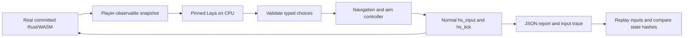

# AI gameplay QA

Laya is a test-time autonomous player, never a shipped BLACKSITE dependency.
Stage 1 proves the engine/state/decision/input loop with a small manual CI run.
It does not assert campaign or boss completion, establish weapon balance, or
replace the existing browser and Rust tests.



## Exact runtime

- Model: `convaiinnovations/laya`, subfolder `typed-decisions`.
- Revision: `7b928d828b7b0e022f929d9bd2e44165aa270148`.
- Parameters: 421,293,827; Apache 2.0 model license.
- SDK: Laya 0.4.0, eager PyTorch 2.8.0+cpu, Transformers 4.57.1, Python 3.12.
- Runtime: one persistent Python process with two CPU inference threads; Node 24
  loads the game's WASM using its built-in runtime. No WASM runtime package or
  frontend npm installation is needed by this workflow.
- Protocol: bounded JSONL requests/responses, with initialization and inference
  deadlines. Model logs go to a separate file, not the protocol stream.
- Dependencies are fully pinned in `scripts/ai/requirements.txt`. Checkpoint and
  SDK pins live in `scripts/ai/config.json`; no `latest` weights are downloaded.

The SDK supports CPU eager execution of the encoder and typed decision head;
GGUF is unnecessary for this prototype. Only the selected checkpoint is loaded.
[Upstream model card](https://huggingface.co/convaiinnovations/laya).

## Observation and actions

The harness reuses the HUD layout and enemy decoder from the game. It reads
`hs_hud_ptr`, `hs_prepare_enemies`/`hs_enemy_cues`, and the map/door exports.
Only living enemies with line of sight and an on-screen horizontal position
enter the model observation. Hidden enemy coordinates and exact enemy health
are omitted. The visible hostile count, player health/ammo/ownership, position,
damage direction, reload state, boss HUD and objective coordinates are already
shown in the HUD/minimap. The route controller uses that minimap geometry.

One SDK prediction requests movement and combat choices, plus utility choices
when reload or interaction is applicable. Input state uses rounded numbers and
a 1,024-token context; truncation is treated as an integration failure. Aim and
navigation are deterministic controllers. Scanning applies while stationary so
it cannot oppose navigation steering. Firing requires a visible target, ammo,
no active reload and no indicated self-splash risk. The first scenario retains
the normally equipped pistol; broader weapon selection is deferred.

At most 24 decisions hold keys for 30 fixed 1/60-second ticks each. Mouse deltas
apply once. Significant damage, kills, empty magazines, completed reloads, boss
phase changes and a newly visible enemy interrupt the interval. Wall time spent
in model inference does not advance game time. Normal death ends the run and
is reported as player failure, rather than failing CI.

During play the harness does not call `hs_qa`, grant weapons, teleport, patch
memory, skip waves, render frames or enable god mode. Short-tier setup uses the
normal checkpoint loader to start isolated stock sectors 2 and 3; only the saved
sector number changes. The agent cannot call that loader. A separate normal-input preflight checks
movement, turning, ammo consumption, reload transfer and interaction input
acceptance. It does not count those probe actions as AI gameplay. Interaction
acceptance at spawn is not proof of objective completion; an actual nearby
interaction effect and objective/boss progression require later scenarios.

## Reproducibility and failure handling

Each episode begins with a fresh `hs_init`: sector 1, ordinary health, enemies
and pistol. The engine currently seeds that start with `0xC0FFEE`. Model inference
uses seed 1729 and deterministic Torch algorithms. Across different CPU/runtime
versions, predictions may change; the guaranteed replay is the recorded input
trace, not regenerated model decisions.

The harness checks finite HUD/enemy/door values, map bounds, player geometry,
nonnegative ammo/counts and an advancing simulation clock. A fresh WASM instance
replays every recorded input and compares complete decoded state hashes at each
decision boundary. Different ML latency cannot alter this replay.

Malformed typed output produces neutral input and an integration failure report;
it cannot select arbitrary exports or inject bits/mouse values. WASM traps,
invalid state, broken input preflight, protocol/schema errors and replay divergence
fail the workflow. Poor aiming, normal death, no kills, and ineffective movement
are reported separately. Detecting permanent stalls or impossible encounters as
engine regressions needs dedicated reproducible scenarios, not an arbitrary AI
failure to complete the sector.

## Run locally or on GitHub

Use an isolated environment; do not install ML dependencies into the game:

```sh
python3 -m venv .blacksite/laya-venv
.blacksite/laya-venv/bin/pip install --index-url https://download.pytorch.org/whl/cpu torch==2.8.0+cpu
.blacksite/laya-venv/bin/pip install -r scripts/ai/requirements.txt
BLACKSITE_AI_PYTHON="$PWD/.blacksite/laya-venv/bin/python" \
  HF_HOME="$PWD/.blacksite/huggingface" npm run test:ai:smoke
```

Tests of input validation, observations and deterministic replay need no model:

```sh
node --experimental-strip-types --test scripts/ai/simulation.test.mjs
```

Dispatch the **AI gameplay QA** workflow in GitHub Actions or use
`gh workflow run ai-game-smoke.yml`. It runs on the standard `ubuntu-latest` CPU
runner, checks committed WASM synchronization, installs CPU-only Torch and pinned
packages, caches model files and runs the short smoke test. It has a 25-minute job timeout per model, no PR trigger and no deployment
dependency. The default remains the 24-decision Laya smoke. Select `short` for
three independent sector starts, with at most 48 decisions per sector and 60
ticks per decision and a 180-second inference budget per sector, or `comparison` to run both models on identical scenarios.

The output directory defaults to ignored `.blacksite/ai-smoke/` and contains:

- `report.json`: separate checks, player warnings, categorized failures, model
  revision/device/parameter count, RSS, WASM hash, configuration and metrics.
- `summary.txt`: readable PASS/FAIL and observed gameplay actions.
- `trace.jsonl`: observations, choices, effective inputs, ticks, state hashes and
  inference timings/token usage for each decision.
- `laya.log` or `decider.log`: model initialization/inference diagnostics.

The workflow publishes the text as its job summary and retains all four files
as a 14-day artifact per model. `wallSeconds` measures the harness; total workflow runtime
also includes provisioning, dependency installation and model/cache transfer.

## Measurements and next step

Initial local CPU loading took about 33 seconds including a cold model download
and peaked around 2.8 GiB process RSS. These are local measurements, not promised
runner timings; each report records its own load, inference, memory and wall time.
Hosted measurements are saved in each job summary and `report.json`; total job
runtime is shown in the [CPU smoke runs](https://github.com/Idanbot/wasm-doom/actions/workflows/ai-game-smoke.yml).

The final local 24-decision run passed with 12 shots, two kills, one observed
interaction effect and exact deterministic replay. It simulated 9.77 seconds;
its harness wall time was 305 seconds while other local checks were running.
The agent did not reload its empty pistol despite reserve ammo; the independent
reload contract passed, so this is a player warning, not an engine failure.

The first [hosted CPU validation](https://github.com/Idanbot/wasm-doom/actions/runs/37661281048)
on 2026-10-07 **passed** on the standard free public-repository `ubuntu-latest`
runner, with no GPU or inference service:

| Measurement | Result |
| --- | --- |
| Total workflow runtime, including setup/artifact/cache work | 3 minutes 18 seconds |
| Harness wall time | 106.72 seconds |
| Model loading | 10.02 seconds |
| Model decisions / SDK predictions | 24 / 24 |
| Inference time, all predictions | 95.01 seconds |
| Simulation time | 9.77 seconds, 586 ticks |
| Model parameters | 421,293,827 |
| Python/Laya peak RSS | 2,805 MiB (2.74 GiB) |
| Node/WASM peak RSS | 926 MiB (0.90 GiB) |
| Shots / kills | 12 / 2 |
| Interaction attempts / effects observed | 5 / 1 |
| Player health remaining / damage taken | 88 / 12 |
| Deterministic input replay | PASS |
| Invalid model outputs / system failures | 0 / 0 |

The hosted run reproduced the local gameplay outcome and recorded the same
reload warning. Runtime and memory include no guarantee for later runners or
larger scenarios. The run's `ai-game-smoke-1` artifact contains the full JSON
report, trace, summary and diagnostics.

The checkpoint emits a warning about an out-of-range calibration temperature
for choices with eleven or more options. Our schemas have at most six choices;
the harness nevertheless does not use model confidence as a correctness oracle.
The model is trained on business decision workflows, so its gameplay skill needs
independent evaluation.

Next after the expanded scenarios below: add first-boss progression and genuine
consecutive sector completion using normal play. Evaluate survival and objective
coverage across repeated matched trials before selecting a different default
model, game-specific fine-tuning or required PR execution.

## Expanded scenarios and optional Decider

The short tier exercises stock sectors 1, 2 and 3 independently, with unchanged
health, pistol, inventory and engine difficulty. Each sector has its own report,
input trace and deterministic replay, plus an aggregate report. Each sector stops after 48 decisions, death, victory
or 180 seconds of accumulated inference (checked after each response); no more
than one 60-second inference can overshoot the time budget. Budget exhaustion
is recorded as a warning, not a fabricated engine regression. These starts are
checkpoint fixtures, not a claim that the agent cleared previous sectors. Death
ends that episode; the next independent scenario still runs. Sector completion
is reported only if the real game reaches its won state. There is no automatic
boss skip or forced campaign advance.

A scripted observable-state baseline runs the same scenarios before ML setup.
It demonstrates combat/reload/door behavior without requiring a model to choose
well. Its decisions are not counted as inference calls or AI achievements.
The model-independent tests additionally cover distinct sector layouts, exact
checkpoint replay, held fire with empty magazines, reserve conservation, explicit
reload, real door interaction and enemy damage, long mixed-input sequences,
invalid states and unsafe input rejection. Regular CI runs these without loading
any model.

Keep **Laya as the default smoke model**, with **Decider as a manual comparison**
until the reports establish better survival, progress or coverage at a reasonable
CPU cost. A larger parameter count is not evidence of better BLACKSITE play.
The original [Decider-4B repository](https://huggingface.co/Mapika/decider-4b)
is correct, but its root currently serves v2.1; v2 is tag `v2`, commit
`49564ddcfccafb6db563eb757c1d41e6c78dcb56`.

This harness uses the publisher's [4B GGUF v2.1 Q4_K_M](https://huggingface.co/Mapika/decider-4b-GGUF),
explicitly labeled **v2.1**, not v2. It is 2,708,804,640 bytes, pinned to
`b79f09d9ba7837f1b744295ea267b55d08e958ec`, with a verified SHA-256 in
`decider-config.json`. The Apache 2.0 model remains external to the repository
and deployed game. Decider SDK 1.8.1 reads typed option-letter logits through
llama-cpp-python 0.3.35, with four CPU threads, zero GPU layers and a bounded
2,048-token context. It does not generate arbitrary command text. The GGUF SDK
path is installed with `--no-deps` after its explicitly pinned CPU dependencies;
GPU-only Flash Linear Attention/Triton packages are unnecessary.

The [standard public Ubuntu runner](https://docs.github.com/en/actions/reference/runners/github-hosted-runners)
has 4 CPUs, 16 GB RAM and 14 GB SSD. The 2.7 GB quantization leaves substantially
more room than 8.4 GB BF16 weights. Publisher timings use eight server CPU threads
and short prompts; they are not a prediction of this workflow's performance.

Checkpoint caches are separate and keyed only by model, immutable revision and
format. Changing scenario length does not download weights again. Only Laya's
model directory or Decider's Q4 weights/tokenizer/config are cached; BF16 and Q8
are excluded. Pip's cache separately retains the built CPU llama.cpp wheel and
pinned dependencies. No paid cache expansion is configured. Cache eviction is
safe: a miss downloads the same pinned checkpoint again.

```sh
# Existing Laya environment; three bounded independent sectors:
BLACKSITE_AI_PYTHON="$PWD/.blacksite/laya-venv/bin/python" \
  HF_HOME="$PWD/.blacksite/huggingface" npm run test:ai:short
# Fast baseline, no Python/model required:
BLACKSITE_AI_MODEL=scripted npm run test:ai:short
# Hosted head-to-head comparison:
gh workflow run ai-game-smoke.yml -f tier=short -f model=comparison
```

For a separate local Decider environment, install CPU Torch as above, then
`pip install -r scripts/ai/decider-requirements.txt` and
`pip install --no-deps decider-ai==1.8.1`. Set `CMAKE_ARGS=-DGGML_CUDA=OFF\ -DGGML_NATIVE=OFF`
and `CMAKE_BUILD_PARALLEL_LEVEL=4` before installing the requirements. Run with
`BLACKSITE_AI_MODEL=decider BLACKSITE_AI_PYTHON=<that-venv>/bin/python`.
Both players share exactly the same observations, legal choices, translator,
normal input API, limits and replay checks. Models load sequentially across
sectors to release memory. No trained model is imported by production code.
