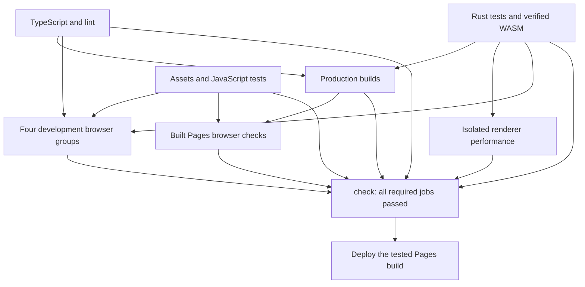

# Continuous integration

CI separates fast source checks, art validation, Rust, builds, renderer measurements
and browser testing. Independent jobs run in parallel. Node 24 and Ubuntu 24.04
are explicit; the runner image cannot silently move the browser to a new OS.

## Jobs and artifacts

- **quality:** validates workflow definitions with pinned Actionlint, then runs
  separate TypeScript and lint steps.
- **assets:** validates committed WASM synchronization, texture and environment
  manifests, maps, projectiles, audio and voices, then runs the full JavaScript
  and asset unit suite. Chromium supplies image decoding for art tests. Python
  dependencies use a managed interpreter and cache.
- **engine:** rejects a stale committed WASM before rebuilding; runs Clippy and
  release-mode Rust tests with two test threads; builds WASM once and tests its
  map-object presentation contract. Shares `verified-wasm` with its source hash.
  This job needs Node but does not install frontend dependencies.
- **build:** builds both supported production targets using verified WASM. Shares
  `pages-shell`, including `.nojekyll`, the compiled app and WASM, while excluding
  unchanged `game/` media. Consumers attach `public/game` from the same commit.
- **performance:** benchmarks verified WASM on a separate runner, without
  browser processes competing for CPU. Preserves the measured performance JSON.
- **browser:** four matrix jobs cover interface, combat, campaign and smoke tests.
  Tests within a group run sequentially to avoid interference. The groups start
  once source checks, assets and engine pass; they do not wait for a production
  build they do not use. Chromium downloads are cached; Linux dependencies are
  installed on each fresh runner. All groups retain screenshots and server logs,
  including on failure, and stop their own servers.
- **pages:** serves the actual shared Pages build under the repository's path.
  Tests thumbnails, production QA restrictions and deployed audio paths.
- **check:** runs even when upstream jobs fail or skip and requires every job to
  succeed. Use this stable status as the branch-protection requirement.

Pages deployment starts only after successful push CI on `main`. It checks that
this is still the current main commit, checks out that exact SHA and deploys the
Pages build tested by CI. It does not rebuild after testing. Pull-request builds
cannot enter this privileged workflow. Manual deployment also requires successful
push CI for the current SHA. Build artifacts expire after three days; rerun CI
before a later redeployment. Browser and performance diagnostics last seven days.

Parallel jobs reduce the critical path, but add runner setup and checkout work.
Compare actual workflow duration and total runner minutes after the first hosted
run; no fixed speedup is promised.

## Optional AI gameplay QA

The separate manually dispatched `ai-game-smoke.yml` workflow uses only pinned
Decider-4B v2.1 Q4_K_M on a standard CPU runner against the real WASM simulation.
It uses neither a browser nor the renderer and does not gate Pages deployment.
The default `extended` tier tests sectors 1–3 with at most 256 decisions and
1,800 inference seconds per sector. A 45-minute job timeout leaves room for
installation, checkpoint loading, replay and artifact upload. Normal death or
victory ends an episode earlier.

A repository-wide workflow concurrency group queues dispatches without cancelling
active runs, even across branches. Matrix `max-parallel: 1` executes sector jobs
sequentially. Three full-budget episodes can therefore take about 90 minutes of
inference in total, plus setup; 30 minutes is a per-sector inference budget, not
a workflow wall-clock deadline. `smoke` (24 decisions) and `short` (48 decisions /
180 inference seconds per sector) retain their smaller budgets.

The dependent report job combines confidence, latency, CPU usage and gameplay
metrics and checks for missing sector reports. Checkpoint cache keys are unchanged
by runtime budgets. See [AI gameplay QA](AI_GAME_QA.md) for model pins, setup,
reports and historical comparisons.
