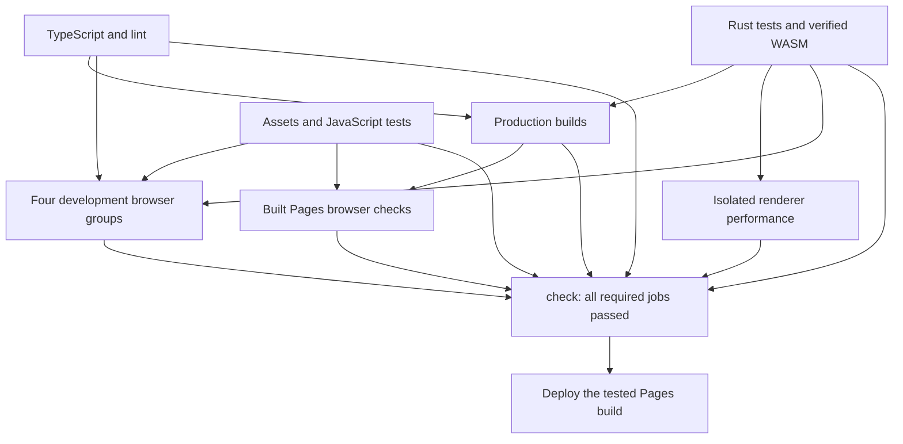

# Continuous integration

CI separates fast source checks, art validation, Rust, builds, renderer measurements
and browser testing. Independent jobs run in parallel. Node 24 and Ubuntu 24.04
are explicit; the runner image cannot silently move the browser to a new OS.



## Jobs and artifacts

- **quality:** validates workflow definitions with pinned Actionlint, then runs
  separate TypeScript and lint steps.
- **assets:** validates committed WASM synchronization, texture and environment
  manifests, maps, projectiles, audio and voices, then runs the full JavaScript
  and asset unit suite. Python dependencies use a managed interpreter and cache.
- **engine:** rejects a stale committed WASM before rebuilding; runs Clippy and
  release-mode Rust tests with two test threads; builds WASM once and tests its
  map-object presentation contract. Shares `verified-wasm` with its source hash.
  This job needs Node but does not install frontend dependencies.
- **build:** builds both supported production targets using verified WASM. Shares
  `pages-shell`, including `.nojekyll`, the compiled app and WASM, while excluding
  unchanged `game/` media. Consumers attach `public/game` from the same commit.
- **performance:** benchmarks verified WASM on a separate runner, without
  browser processes competing for CPU. Preserves the measured performance JSON.
- **browser:** four matrix jobs cover interface, combat, campaign and smoke tests.
  Tests within a group run sequentially to avoid interference. The groups start
  once source checks, assets and engine pass; they do not wait for a production
  build they do not use. Chromium downloads are cached; Linux dependencies are
  installed on each fresh runner. All groups retain screenshots and server logs,
  including on failure, and stop their own servers.
- **pages:** serves the actual shared Pages build under the repository's path.
  Tests thumbnails, production QA restrictions and deployed audio paths.
- **check:** runs even when upstream jobs fail or skip and requires every job to
  succeed. Use this stable status as the branch-protection requirement.

Pages deployment starts only after successful push CI on `main`. It checks that
this is still the current main commit, checks out that exact SHA and deploys the
Pages build tested by CI. It does not rebuild after testing. Pull-request builds
cannot enter this privileged workflow. Manual deployment also requires successful
push CI for the current SHA. Build artifacts expire after three days; rerun CI
before a later redeployment. Browser and performance diagnostics last seven days.

Parallel jobs reduce the critical path, but add runner setup and checkout work.
Compare actual workflow duration and total runner minutes after the first hosted
run; no fixed speedup is promised.

## Optional AI exploration: recommendation, not an enabled CI job

Try **Laya typed-decisions (421M parameters)** as an advisory, CPU-based explorer
on a manual or nightly workflow. It takes text/JSON state and selects from typed
choices; it cannot inspect screenshots. Its published checkpoint was trained on
business workflows, not FPS play, so measure it on BLACKSITE decisions before
relying on it. Fine-tuning is likely needed for useful gameplay decisions.
[Model card and SDK usage](https://huggingface.co/convaiinnovations/laya).

For occasional screenshot triage, **SmolVLM2-500M-Video-Instruct (500M)** accepts
images and video. Treat its observations as suggestions requiring reproduction;
it is not a reliable pixel-level HUD or sprite oracle. Its published examples
use a GPU, so CPU latency must be measured before scheduling it on standard
runners. [Model card](https://huggingface.co/HuggingFaceTB/SmolVLM2-500M-Video-Instruct).

Standard public Ubuntu runners provide four CPUs and 16 GB RAM. CPU inference
and Chromium share those resources; parameter count alone does not establish
memory use or latency. Keep AI exploration separate from renderer benchmarks.
[GitHub runner specifications](https://docs.github.com/en/actions/reference/runners/github-hosted-runners).

### Proposed implementation

1. Add an opt-in `workflow_dispatch`/nightly workflow, initially independent of
   the deployment gate. Use the shared Chromium setup and the existing dev
   server. Pin Python packages and the model revision; cache only the selected
   checkpoint, not the whole model family. No external inference service or
   account secret is needed for public weights.
2. Use Playwright for actual input. Expose a bounded read-only development
   observation containing HUD/ammo, position, nearby hostiles, collision data,
   reachable objectives and legal actions. Existing `__controlsTest` hooks help
   with observation, but do not use `setKeys` for normal play: it enables QA
   behavior. Do not enable `qa=1` or god mode in this exploration.
3. Give Laya compact JSON and six to ten legal choices such as advance, retreat,
   aim/fire, reload, interact and switch weapon. Let deterministic controllers
   perform aiming and navigation; let the model choose the next bounded action
   or scenario. Start at one decision per second, five minutes and three fixed
   seeds; stop early on an invariant violation. Keep input under the checkpoint's
   1,024-token context and record observations/actions for deterministic replay.
4. Independent assertions check crashes, loading readiness, enemy-wall overlap,
   HUD clipping, ammo bounds, reload interruption and reward progression. A model
   choice or claimed success is never itself a pass/fail oracle. Existing exact
   Playwright tests remain required on every PR.
5. Upload a JSONL trace, console errors, screenshots and a replay seed. Compare
   scenario coverage and reproducible bugs against an equally bounded scripted
   explorer. Add a game-specific labeled decision set and evaluate a fine-tuned
   model before deciding whether inference justifies its runtime.

The documented SDK call for a single typed checkpoint is:

```python
import laya

agent = laya.load("convaiinnovations/laya", subfolder="typed-decisions")
questions = {
    "action": {
        "type": "choice",
        "instructions": "Choose the next legal action for this test scenario.",
        "criteria": {
            "reload": "Magazine empty; reserve ammunition available.",
            "fire": "Visible hostile in aim; magazine has ammunition.",
            "advance": "Follow the supplied reachable waypoint.",
            "retreat": "Move to the supplied cover waypoint when threatened.",
            "interact": "An objective is reachable and nearby.",
            "switch_weapon": "Current weapon has no usable ammunition.",
        },
    },
}
# Observation comes from the proposed Playwright bridge; this is not a runner.
result = agent.predict(observation, questions)
action = result["answers"]["action"]["choice"]
# Validate action against current legal actions before dispatching real input.
```

Prune illegal choices before prediction and skip prediction when only one choice
is legal. This is an integration outline; the bridge, labeled dataset and AI
workflow are deliberately not installed as CI dependencies by this change.
