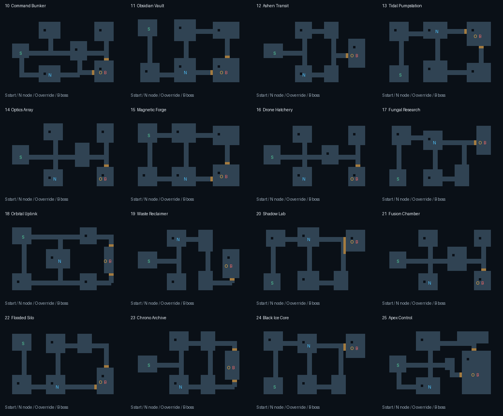

# Map authoring guide

BLACKSITE has 25 sectors on a 48×32 grid. Levels 1–9 use the authored carvers in `engine/src/map.rs`. Levels 10–25 use explicit room graphs in `art/maps/layouts-10-25.json` and the typed tables/runtime in `engine/src/layouts.rs`. Geometry does not cycle until the first 25 sectors have been played; sector 26 restarts Upper Works with gradual endless scaling.

Each rebuilt sector specifies six rooms, a connected graph with alternate routes, wall materials, start pose, sector node, override, two boss spawn positions, two terminals, resupply, a powerup, and a themed hostile cast. Two-cell corridors join room centers with an explicitly chosen bend direction. Arena entrance doors auto-open from outside and seal during the boss encounter. Offset machinery cover breaks room sightlines. Props use the sector's machinery family, and six breakable objects use its exclusive sector art. Apex Control has a larger command arena.

| Levels | Traversal |
|---|---|
| 10–11 | Command wings and vault perimeter loops |
| 12–15 | Parallel transit lanes, pump circuit, optical crossfire chambers, forge ring |
| 16–19 | Hatchery branches, containment loop, uplink spokes, reclamation switchbacks |
| 20–23 | Shadow bypasses, fusion wings, silo perimeter, archive cross-links |
| 24–25 | Black Ice cooling circuit and Apex command wings leading to a large final arena |

Edit the JSON, run `python3 scripts/render-sector-layouts.py` to refresh the diagram and arena doors, then run `python3 scripts/build-sector-layout-data.py` to regenerate the typed tables. This preserves the runtime implementation and tests below the table. Keep node, terminal, resupply, cover and hostile coordinates inside walkable room interiors. Coordinates are shared with `map` and `field` accessors, so geometry and gameplay objectives use one contract.

Clearing ordinary hostiles and using the sector node arms the boss override. USE requires proximity and line of sight. The override launches the existing boss-specific sequence; the boss's reward and next-sector behavior are preserved.

Validation must cover all objectives and spawns, connected floors with a sealed outer boundary, alternate graph routes, room clearance and props outside walls. Run Rust tests, `npm run build:wasm`, `npm run check:wasm`, and the campaign browser checks after changes. Inspect the layout overview and in-game views; flood-fill alone does not establish combat quality.
